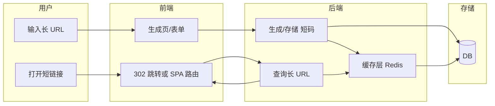
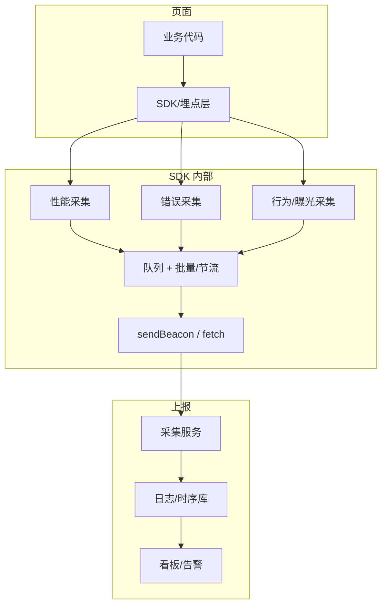
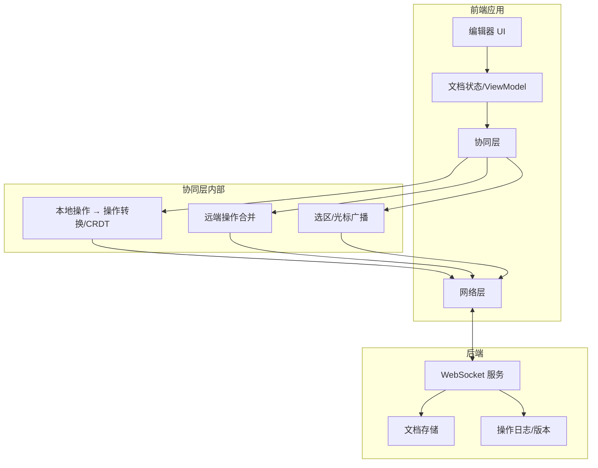
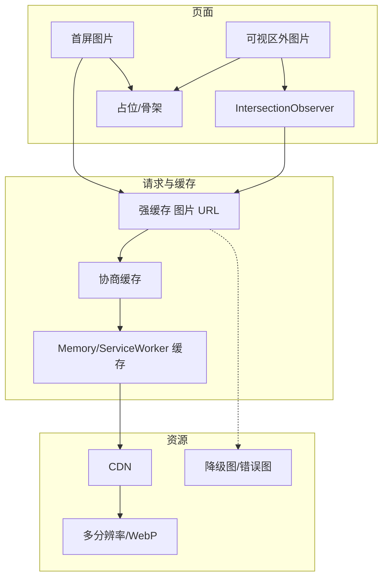
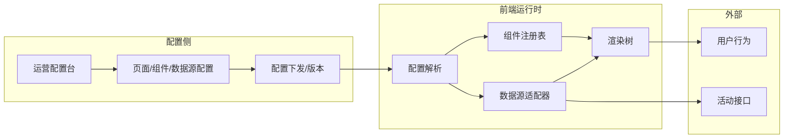

# 前端系统设计题（含架构图与文字说明）

> 2026-02-05 · 考察系统设计、架构图、接口与前端职责划分

---

## 1. 设计一个短链接服务（前端视角）

### 题目

从 0 设计一个短链接系统：用户输入长 URL，得到短链接并支持跳转。要求从前端到后端的整体流程、前端职责、可扩展性做说明。

### 考察点

- 前后端职责划分
- 前端存储与重定向方式
- 高并发与缓存思路

### 架构图

### 文字说明

- **前端职责**：  
  - 提供「生成短链」页：输入长 URL，调用后端 API（POST /api/shorten），展示短链与二维码。  
  - 短链跳转：浏览器请求短链域名（如 s.example.com/abc），后端返回 302 Location: 长 URL，前端无需落地页；若需统计或风控，可先到前端落地页再 302 或 meta refresh。  
- **后端职责**：生成唯一短码（发号器或 hash+冲突检测）、存储 长 URL↔短码、解析短码查长 URL、302 响应；可加 Redis 缓存热点。  
- **扩展**：短链域名独立、前端 CDN 静态资源、后端分库分表或按短码分片。

---

## 2. 设计前端监控与埋点系统

### 题目

设计一套前端监控系统，能采集页面性能、错误、用户行为，并支持实时/离线上报与简单看板。画出前端架构并说明各模块职责。

### 考察点

- 采集类型（性能、错误、行为）
- 上报策略（即时、批量、失败重试）
- 与业务解耦、对性能影响

### 架构图

### 文字说明

- **采集层**：  
  - 性能：Performance API（FP/FCP/LCP、FID/INP）、Resource 时序、首屏/自定义打点。  
  - 错误：window.onerror、unhandledrejection、跨域 script 与 source map 解析。  
  - 行为：点击、曝光（IntersectionObserver）、路由切换、关键业务事件。  
- **SDK 设计**：  
  - 与业务解耦：通过初始化注入 appId、userId，事件统一 event/params 结构。  
  - 队列 + 批量：先推入内存队列，按条数或时间窗口批量上报；页面卸载用 sendBeacon 或 keepalive fetch，失败做重试与本地缓存。  
- **服务端**：接收上报的采集服务（鉴权、限流）、写入 Kafka/日志/时序库，再接入实时计算与看板（如 LCP 分布、错误率、UV/PV）。

---

## 3. 设计一个在线文档/富文本协作编辑（前端架构）

### 题目

类似飞书/语雀的在线文档：多人实时编辑、光标与选区同步、富文本。只要求从前端角度画出模块划分、数据流与同步思路。

### 考察点

- 编辑器与状态管理
- 实时同步（WebSocket/CRDT 或 OT）
- 冲突与一致性

### 架构图

### 文字说明

- **编辑器与状态**：  
  - 使用 Slate/ProseMirror 等引擎，维护一份文档树状态；用户输入产生本地 op，先应用到本地（乐观更新），再交给协同层。  
- **协同层**：  
  - 方案一：OT（Operational Transform），本地 op 与来自服务端的 op 做转换后应用，保证最终一致。  
  - 方案二：CRDT（如 Yjs），无中心转换，合并算法保证收敛。  
  - 选区/光标：通过单独通道广播（userId、range、caret），不参与文档一致性，仅展示。  
- **网络与后端**：  
  - 建立 WebSocket 长连，进入文档时拉取当前状态与版本，之后只传 op 或 delta；服务端可做 op 落地、广播、权限与版本管理。

---

## 4. 设计一个图片/资源加载与 CDN 优化方案（前端）

### 题目

列表页有大量图片，要求首屏快速、流量可控、弱网可用。从前端角度设计加载策略并画出请求与缓存流程。

### 考察点

- 首屏优先、懒加载、占位
- CDN 与缓存策略
- 降级与错误处理

### 架构图

### 文字说明

- **首屏**：  
  - 首屏图片用 `` 或预加载（preload）优先加载，带 width/height 或 aspect-ratio 防塌陷；可配合 LCP 监控。  
- **懒加载**：  
  - 可视区外图片用 data-src 或占位，IntersectionObserver 进入视口再设 src；可加 rootMargin 提前加载。  
- **CDN 与缓存**：  
  - 图片 URL 走 CDN，带 hash 的路径强缓存；变更少用 Cache-Control: max-age；需要时用 304 协商缓存。  
  - 可选：Memory Cache、Service Worker 缓存列表页已加载图，二次进入直接用缓存。  
- **降级**：  
  - 支持 WebP 时用 `<picture>` 或 URL 参数；加载失败 onerror 替换为占位图或重试；弱网可降低分辨率参数或限并发数。

---

## 5. 设计一个「活动配置化搭建」前端系统

### 题目

运营通过配置生成活动页（表单、抽奖、排行榜等），前端根据配置渲染页面并对接接口。画出配置到渲染的架构与数据流。

### 考察点

- 配置驱动 UI（JSON Schema / 组件映射）
- 组件与数据源解耦
- 扩展性与安全

### 架构图

### 文字说明

- **配置结构**：  
  - 页面 = 树形结构，节点含 type（如 form、lottery、rank）、props、children、dataSource（接口 id、映射关系）。  
  - 组件注册表：type → 实际 Vue/React 组件，保证只渲染白名单组件，避免任意组件注入。  
- **运行时**：  
  - 拉取配置（或内置兜底）→ 解析树 → 按 type 从注册表取组件，递归渲染；数据源适配器根据 dataSource 请求接口并注入 props。  
- **扩展与安全**：  
  - 新增活动类型 = 新组件 + 注册；配置做 JSON Schema 校验；接口域名与参数白名单，防止 XSS 与越权。

---

以上各题均包含：题目、考察点、Mermaid 架构图、文字说明。架构图可在支持 Mermaid 的 Markdown 预览（如 VS Code、GitHub）中直接查看。
